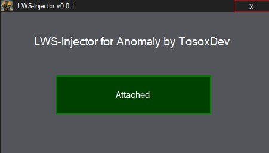

# DLL-Injector

) 

> **Important: This repository is intended as a resource for developers working on DLL-Injection**

## Description

This sample project loads a DLL from a .cs file and stores it as a temporary file on the local disk, which is then injected into a process.
The [data](res/TestDLL.dll.cs) of the DLL was generated and exported with [HxD](https://mh-nexus.de/de/hxd/).

## Preview

